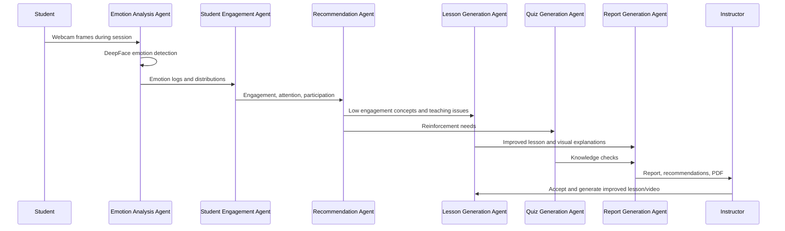

# ADK Multi-Agent Workflow

## Agents

1. Emotion Analysis Agent: webcam frames, DeepFace, emotion logs, distributions.
2. Student Engagement Agent: engagement score, attention timeline, disengagement detection.
3. Recommendation Agent: teaching recommendations from engagement and emotion reports.
4. Lesson Generation Agent: outlines, scripts, objectives, slides, images, diagrams.
5. Quiz Generation Agent: MCQ, true/false, short-answer, answers, difficulty.
6. Report Generation Agent: summaries, analytics, PDF export.
