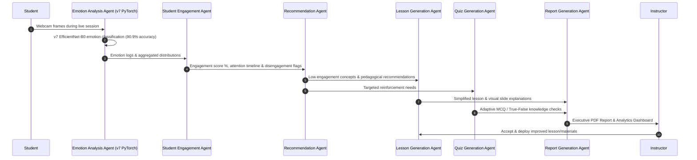

# EduSense Multi-Agent System Workflows

---

## 👨‍🏫 Instructor Workflow
1. **Create & Schedule Session**: Set lesson topic, date, start time, and target student group.
2. **Monitor Live Dashboard**: Real-time webcam emotion feedback (Happy, Neutral, Sad, Surprised, Confused, Disengaged) displayed via interactive Recharts.
3. **Receive AI Recommendations**: Triggers pedagogical suggestions when engagement drops below threshold (<62%).
4. **Export Executive PDF Report**: Automated post-session PDF export via ReportLab summarizing class performance and reinforcement materials.

---

## 🎓 Student Workflow
1. **Join Classroom**: Access scheduled sessions and launch live room interface.
2. **Real-time Engagement Stream**: Webcam frames stream in background to emotion analysis engine.
3. **Adaptive AI Study Tools**: Access AI-generated flashcards, practice quizzes, and lesson slides.

