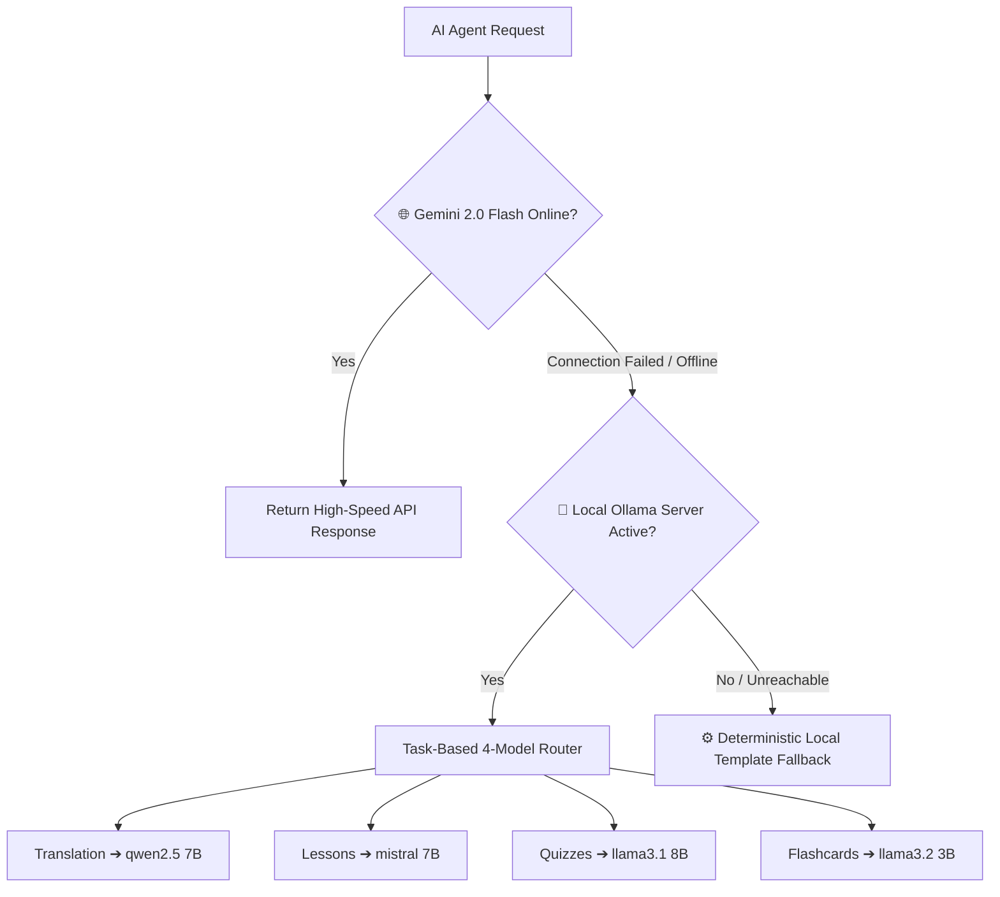
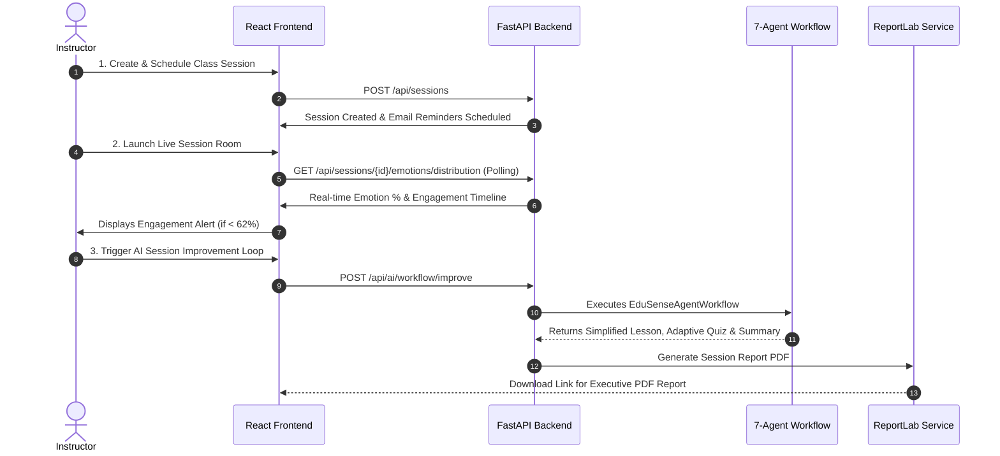
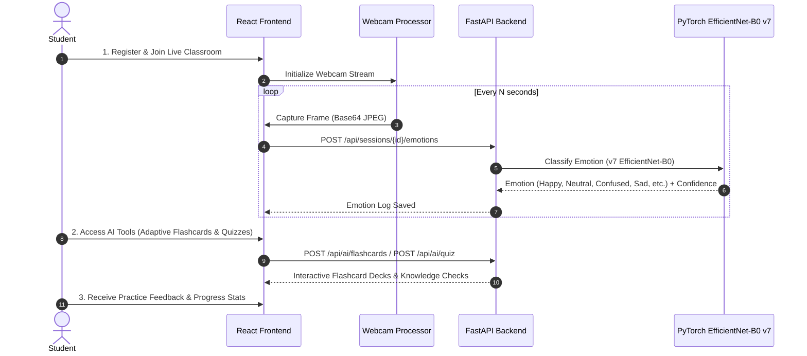
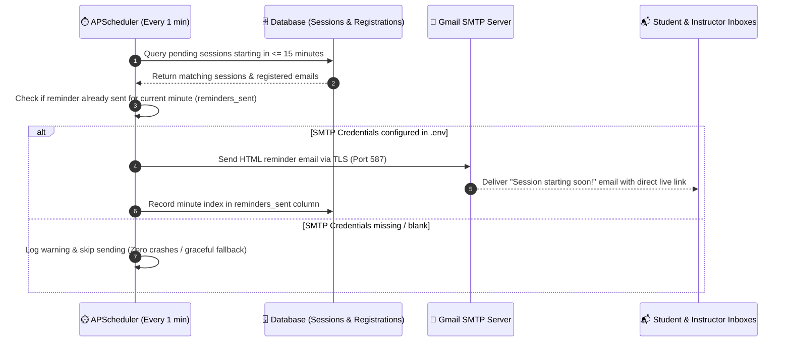

# Architecture & Multi-User System Workflows

```mermaid
flowchart LR
  Student[Student Browser] --> Frontend[React + Vite Frontend]
  Instructor[Instructor Browser] --> Frontend
  Frontend --> API[FastAPI REST API]
  API --> Auth[JWT Security & Security Middleware]
  API --> DB[(PostgreSQL / SQLite ORM)]
  API --> Agents[EduSense 7-Agent Workflow Orchestrator]
  Agents --> Emotion[1. Emotion Analysis Agent - PyTorch v7 EfficientNet / DeepFace]
  Agents --> Engagement[2. Student Engagement Agent]
  Agents --> Recs[3. Recommendation Agent]
  Agents --> Lesson[4. Lesson Generation Agent]
  Agents --> Quiz[5. Quiz Generation Agent]
  Agents --> Flashcard[6. Flashcard Generation Agent]
  Agents --> Report[7. Report Generation Agent]
  API --> Export[ReportLab PDF Service]
  API --> Email[APScheduler + SMTP Email Reminder Service]
  Report --> PDF[Generated PDF Reports]
---

## 👤 Author & Repository
- **Author:** [Adel Mohamed Noufal](https://www.linkedin.com/in/adel-mohamed-noufal-3a9440348/)
- **LinkedIn Profile:** [https://www.linkedin.com/in/adel-mohamed-noufal-3a9440348/](https://www.linkedin.com/in/adel-mohamed-noufal-3a9440348/)
- **GitHub Repository:** [https://github.com/adel-noufal/Edusense](https://github.com/adel-noufal/Edusense)

---

## ⚡ Smart Multi-Tier AI Provider Task Router Diagram

```
                       ┌─────────────────────────────────────┐
                       │          AI Agent Request           │
                       └──────────────────┬──────────────────┘
                                          │
                        ┌─────────────────▼─────────────────┐
                        │ 🌐 Gemini 2.0 Flash (Online API)  │
                        └─────────────────┬─────────────────┘
                                          │  (If Offline / Connection Fails)
                        ┌─────────────────▼─────────────────┐
                        │ 🦙 Specialized Local Ollama LLMs  │
                        │ • Translation -> Qwen 2.5 (7B)    │
                        │ • Lessons     -> Mistral (7B)     │
                        │ • Quizzes     -> Llama 3.1 (8B)   │
                        │ • Flashcards  -> Llama 3.2 (3B)   │
                        └─────────────────┬─────────────────┘
                                          │  (If Ollama Unreachable)
                        ┌─────────────────▼─────────────────┐
                        │ ⚙️ Built-in Local Templates        │
                        └───────────────────────────────────┘
```



---

## 👨‍🏫 Instructor System Workflow



1. **Session Creation & Scheduling**: Instructor creates a class session, setting date, time, and topic.
2. **Live Classroom Monitoring**: During class, the instructor dashboard polls real-time engagement and emotion distributions.
3. **Automated Interventions**: If student engagement drops below threshold (<62%), the system notifies the instructor with pedagogical recommendations.
4. **Post-Session Report Generation**: After class, the workflow compiles session analytics, generates an improved lesson plan, creates a reinforcement quiz, and exports a downloadable PDF report.

---

## 🎓 Student System Workflow



1. **Session Access**: Student views scheduled sessions and joins the live room.
2. **Webcam Emotion Streaming**: Webcam frames are analyzed locally/server-side using the custom **v7 PyTorch EfficientNet-B0** model to log emotion data seamlessly without disrupting the student.
3. **Interactive Study Tools**: Students utilize AI-generated flashcards, practice quizzes, and interactive slide materials tailored to the lesson.

---

## 📧 Email SMTP Notification Workflow



1. **Background Job Execution**: `APScheduler` runs every 60 seconds in the background (`app/core/scheduler.py`).
2. **Upcoming Class Query**: Queries DB for pending sessions starting within 15 minutes.
3. **Recipient Resolution**: Finds email addresses of all registered students plus the class instructor.
4. **HTML Email Dispatch**: Builds responsive HTML email template with direct join link and sends via `smtplib` over TLS (Port 587).
5. **Graceful Fallback**: If SMTP settings are unconfigured, logs a note without interrupting backend execution.

---

## 🗄️ Database Tables

- `users`: User credentials, roles (`instructor`, `student`, `admin`), avatars.
- `profiles`: Extended user metadata and preferences.
- `sessions`: Class sessions, dates, start times, topics, instructor IDs, and reminder statuses.
- `session_registrations`: Student enrollment mappings.
- `emotion_logs`: Timestamped emotion classifications, confidence scores, and session links.
- `reports`: Saved session analytics reports and generated PDF paths.
- `ai_generations`: History of generated lessons, quizzes, and flashcards.

---

## 🔒 Production Hardening Checklist

- ✅ Environment secrets stored in `backend/.env` (never committed to git).
- ✅ Password hashing using `bcrypt` and JWT tokens for auth.
- ✅ Dual AI provider routing with automatic failover (Gemini -> Ollama -> Local templates).
- ✅ Dual ML backend (PyTorch v7 EfficientNet-B0 with DeepFace fallback).
- ✅ APScheduler background job runner for SMTP email reminders.
- ✅ ReportLab PDF generation service.

