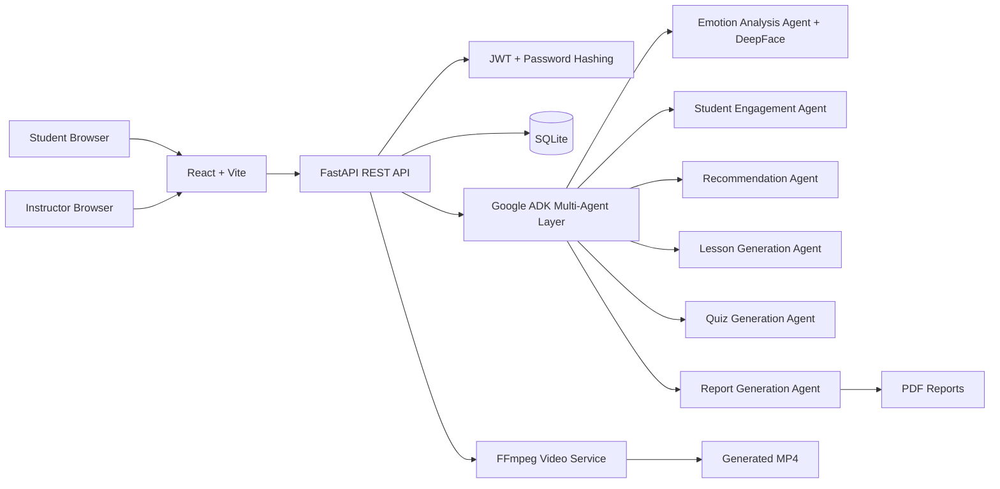

# Architecture

## Tables

- users
- profiles
- sessions
- session_registrations
- emotion_logs
- reports
- feedback
- video_projects
- quizzes

## Production Hardening Checklist

- Replace development secret key.
- Configure HTTPS behind a reverse proxy.
- Add database migrations with Alembic.
- Add background workers for heavy DeepFace and FFmpeg jobs.
- Store generated files outside the app package in production.
- Add rate limits to auth and webcam ingestion endpoints.
